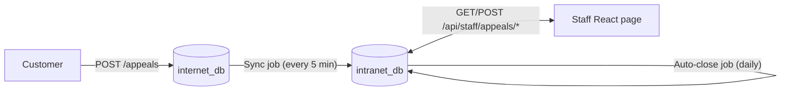
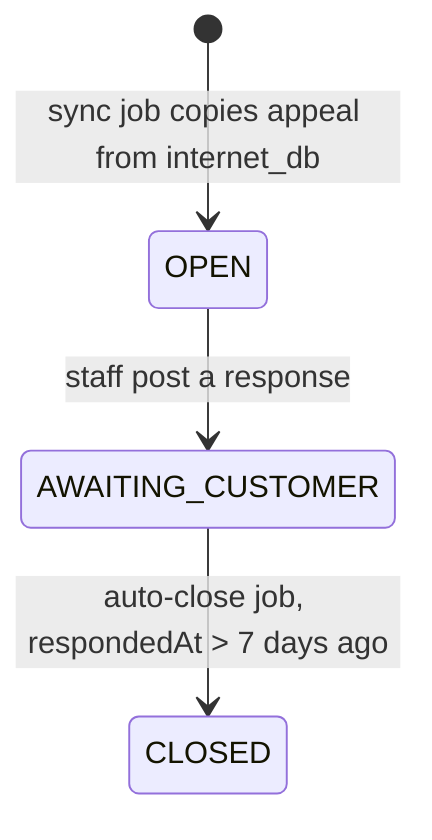

# Technical Overview

## Architecture

Two separate Spring `DataSource` / `EntityManagerFactory` / transaction
manager pairs are configured by hand in `config/InternetDbConfig.java` and
`config/IntranetDbConfig.java` (Spring Boot's default auto-configuration is
disabled — see `AppealAutoCloseApplication`). Each is its own H2 in-memory
instance; they are never joined in a single query or transaction.

## Databases

### `internet_db` — public-facing, source of truth for submissions

Table `appeals` (entity `InternetAppeal`):

| Column        | Type          | Notes                          |
|---------------|---------------|---------------------------------|
| id            | BIGINT (PK)   | auto-generated (IDENTITY)      |
| customerName  | VARCHAR       |                                 |
| subject       | VARCHAR       |                                 |
| message       | VARCHAR(4000) |                                 |
| submittedAt   | TIMESTAMP     |                                 |

Never written to by staff. Only written to by `POST /appeals`.

### `intranet_db` — staff workflow

Table `appeals` (entity `IntranetAppeal`):

| Column          | Type          | Notes                                         |
|-----------------|---------------|------------------------------------------------|
| id              | BIGINT (PK)   | **same value** as the source row in internet_db — NOT auto-generated here, this is how the two DBs are linked |
| customerName    | VARCHAR       | copied at sync time                            |
| subject         | VARCHAR       | copied at sync time                            |
| message         | VARCHAR(4000) | copied at sync time                            |
| submittedAt     | TIMESTAMP     | copied at sync time                            |
| status          | VARCHAR enum  | `OPEN` \| `AWAITING_CUSTOMER` \| `CLOSED`      |
| officerResponse | VARCHAR(4000) | set when staff post a response                 |
| respondedAt     | TIMESTAMP     | set when staff post a response                 |
| closedAt        | TIMESTAMP     | set by the auto-close job (or manual close, if added later) |
| closeReason     | VARCHAR       | e.g. `"auto-closed: no customer reply"`        |
| lastUpdated     | TIMESTAMP     | bumped on every write, used to sort the staff list |

## Status flow

There's no path back from `AWAITING_CUSTOMER` to `OPEN` in this build — the
spec doesn't describe a "customer replied" inbound event, so the demo
doesn't model one. See NOTES.md.

## Endpoints

| Method | Path                                | DB touched   | Purpose                                              |
|--------|-------------------------------------|--------------|-------------------------------------------------------|
| POST   | `/appeals`                          | internet_db  | Public appeal submission (no auth, no UI — API only)  |
| GET    | `/api/staff/appeals`                | intranet_db  | List appeals for the staff page (id, customer, subject, status, lastUpdated), sorted by lastUpdated desc |
| GET    | `/api/staff/appeals/{id}`           | intranet_db  | Full detail for one appeal                            |
| POST   | `/api/staff/appeals/{id}/respond`   | intranet_db  | Body `{ "response": "..." }`. Sets status=AWAITING_CUSTOMER, stamps respondedAt + lastUpdated. Returns 409 if already CLOSED. |

## Scheduled jobs

### Sync job (`service/SyncJob.java`)

- Interval: `app.sync.interval-ms` (default 300000 = 5 min; 20s in the demo profile)
- Reads: all rows in `internet_db`
- Writes: any row whose `id` is **not yet** present in `intranet_db` gets
  copied across as status `OPEN`
- Idempotency: guarded by `existsById(id)` before insert — running the job
  twice (or overlapping runs) never creates a duplicate, since the id is
  the natural key shared by both tables
- Logs one line per copied appeal, plus a summary line per run

### Auto-close job (`service/AutoCloseJob.java`)

- Interval: `app.autoclose.interval-ms` (default 86400000 = 1 day; 30s in demo profile)
- Threshold: `app.autoclose.threshold-minutes` (default 10080 = 7 days; 2 min in demo profile)
- Reads: rows in `intranet_db` where `status = AWAITING_CUSTOMER AND respondedAt < now - threshold`
- Writes: sets `status = CLOSED`, `closedAt = now`, `closeReason = "auto-closed: no customer reply"`, bumps `lastUpdated`
- Logs one line per closed appeal, plus a summary line per run

## Frontend

Plain React + Vite, no router (single page, local `selectedId` state), no
extra state library. `src/api.js` centralizes the three fetch calls against
`http://localhost:8080`. Polls the list every 15s so staff see appeals
arrive from the sync job without a manual refresh.

## Known simplifications (see NOTES.md for reasoning)

- No auth/login on the staff page.
- No endpoint or UI to simulate a customer's reply, since the spec only
  requires the auto-close direction. In reality a "customer replied, reopen
  or resolve" endpoint would exist as well.
- Sync and auto-close jobs are not wrapped in a single cross-database
  transaction (Spring can't natively span two unrelated JPA transaction
  managers without JTA/XA, which is overkill for this demo) — each
  repository call commits independently, and idempotency is handled at the
  application level via existence checks rather than relying on
  distributed-transaction guarantees.
